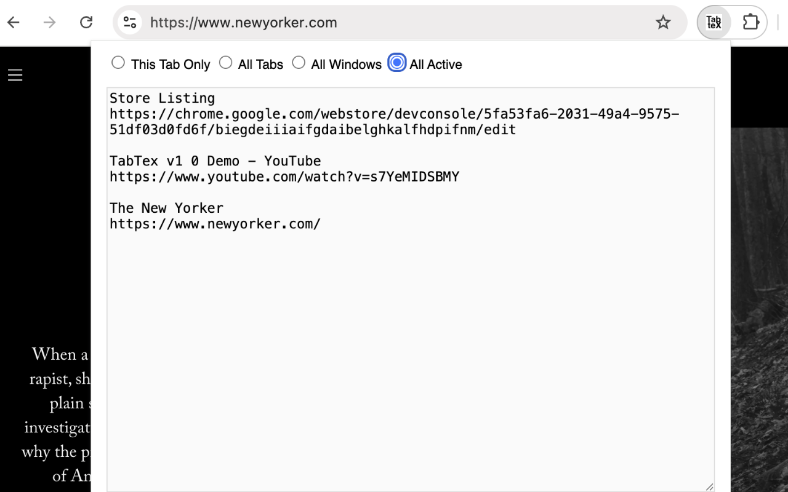

# TabTex: A Google Chrome Extension
TabTex aims to be the most frictionless referencing/url-preserving tool in the browser extensions space! Because you need to remember that useful URL which you visited last week!

Effortlessly export the title and URL of your open tabs as text.

## Features

Choose from four options:
- ✅ Export only the current tab
- ✅ Export all tabs in the current window
- ✅ Export tabs from all open windows
- ✅ Export only active tabs across all windows

TabTex is designed to make saving, documenting, and referencing your tabs fast, simple, and efficient. 🚀

**Please note that this site is used only for issue tracking only**

Report issues here: [https://github.com/madukan/tabtex/issues](https://github.com/madukan/tabtex/issues)

## Setup

Here're the steps to get started: [SETUP](SETUP.md)