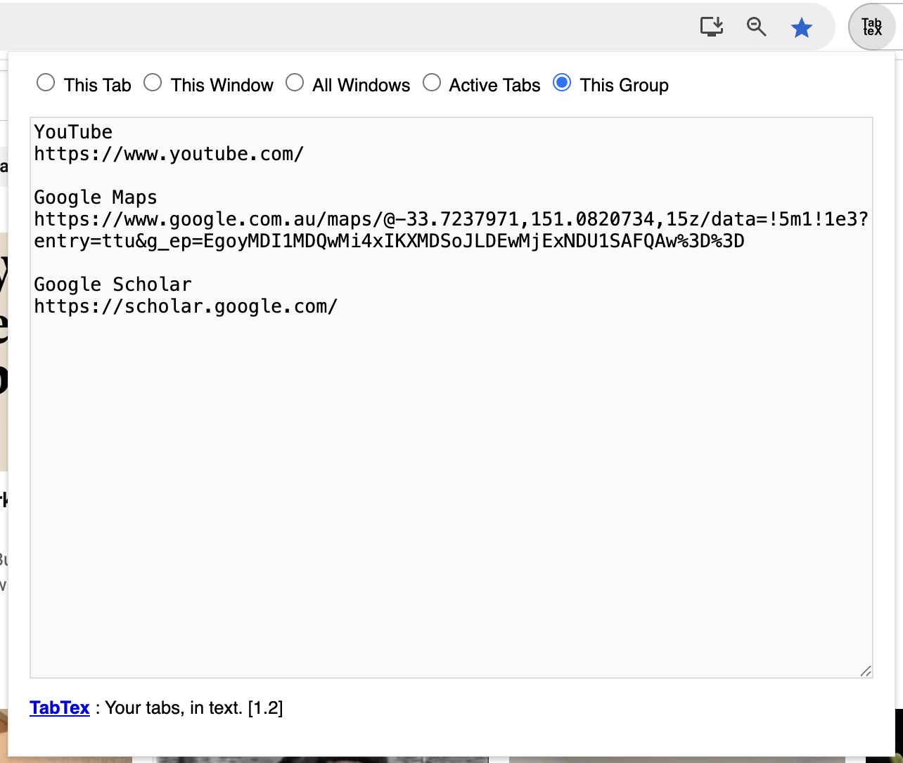

# TabTex: A Google Chrome Extension
TabTex aims to be the most frictionless referencing/url-preserving tool in the browser extensions space! Because you need to remember that useful URL which you visited last week!

Let's you use the CTRL+X or CMD+X to cut and paste across! 
I personally love this as it helps to modify some of the titles to make more sense next time I refer to them!

Effortlessly export the title and URL of your open tabs as text.
[Check it out in the Chrome Webstore](https://chromewebstore.google.com/detail/tabtex-your-tabs-in-text/biegdeiiiaifgdaibelghkalfhdpifnm).

## Features

Get the URLs and Titles for the Tab Group currently in focus:

Get all the active pages' URLs across all the windows (reminds later what was working on):

Choose from four options:
1. Export only the current tab
2. Export all tabs in the current window
3. Export tabs from all open windows
4. Export only active tabs across all windows
5. Export current tab group (group of the tab in focus)

Also, the URLs in the text area can be opened as new tabs in one click too!

TabTex is designed to make archiving, documenting, and referencing your past visited website quickly, simply, and more efficiently (and in a friendlier way! - no formatting gimmics - plain simple text). 🚀

**Please note that this site is used only for issue tracking only**

1. Report issues here: [https://github.com/madukan/tabtex/issues](https://github.com/madukan/tabtex/issues)
2. This repository: https://github.com/madukan/tabtex

## Setup step by step

Here're the steps to get started: [SETUP](SETUP.md)

## Release notes
See: [RELEASE](RELEASE.md)

## Privacy note
See: [PRIVACY](PRIVACY.md)

## Bugs, Issues, Suggestions
 Any suggestions/bugs/issues? [Issue register](https://github.com/madukan/tabtex/issues)
