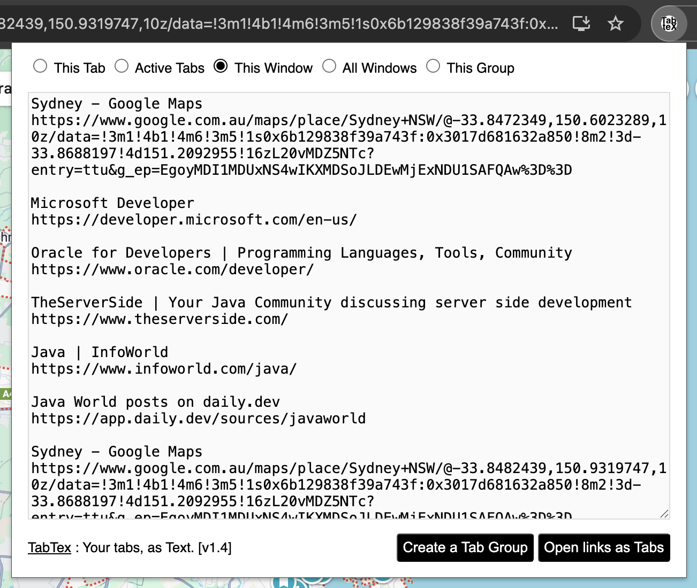

# TabTex: A Google Chrome Extension
TabTex aims to be the most frictionless referencing/url-preserving tool in the browser extensions space! Because you need to remember that useful URL which you visited last week!

Let's you use the CTRL+X or CMD+X to cut and paste across! 
I personally love this as it helps to modify some of the titles to make more sense next time I refer to them!

Effortlessly export the title and URL of your open tabs as text.
[Check it out in the Chrome Webstore](https://chromewebstore.google.com/detail/tabtex-your-tabs-in-text/biegdeiiiaifgdaibelghkalfhdpifnm).

## Features

Get the URLs and Titles for the Tab Group currently in focus:

It is possible to cut/change/copy as you wish before copying over the selection leaving the user with freedom to make the information more relevant for the specific use-case.

A screenshot when there are multi windows and tab groups currently opened. Notice now there're "All Windows" option and "This Group" option. 

**Options (Radio buttons)**

Following are the options available to filter/show the tab url/title details along with their short descriptions of the use-cases. 

| #   | Option (Radio) | Description/Meaning                                                     | Availability                             |
| --- | -------------- | ----------------------------------------------------------------------- | ---------------------------------------- |
| 1   | This Tab       | Current Tab that is in focus                                            | Always                                   |
| 2   | Active Tabs    | Tabs in focus across all the windows                                    | Always                                   |
| 3   | This Window    | All the tabs in current (the window user is actively working on) window | Always                                   |
| 4   | All Windows    | All the windows, despite active or not                                  | When multiple Chrome Windows opened      |
| 5   | This Group     | If a current tab is a part of Tab Group, that group                     | When current tab is part of a tab group  |

Also, the URLs in the text area can be opened as new tabs in one click too!

TabTex is designed to make archiving, documenting, and referencing your past visited website quickly, simply, and more efficiently (and in a friendlier way! - no formatting gimmics - plain simple text). 🚀

**Please note that this site is used only for issue tracking only**

1. Report issues here: [https://github.com/madukan/tabtex/issues](https://github.com/madukan/tabtex/issues)
2. This repository: https://github.com/madukan/tabtex

## Setup step by step
Here're the steps to get started: [SETUP](SETUP.md)

## Release notes
See: [RELEASE](RELEASE.md)

## Privacy note
See: [PRIVACY](PRIVACY.md)

To summarise, this extension only use the URL and Title of the page. It will open new tabs with the URLs supplied in the same content area when the user requested (by clicking the button).

Chrome classification for this component:

## Bugs, Issues, Suggestions
 Any suggestions/bugs/issues? [Issue register](https://github.com/madukan/tabtex/issues)
