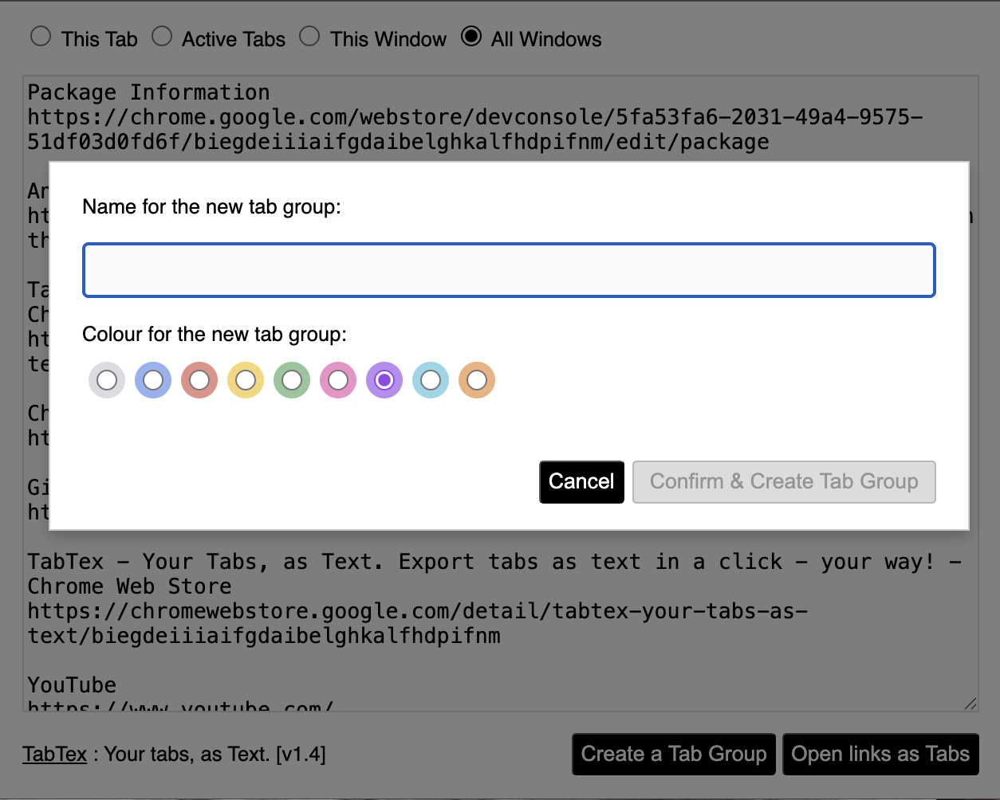
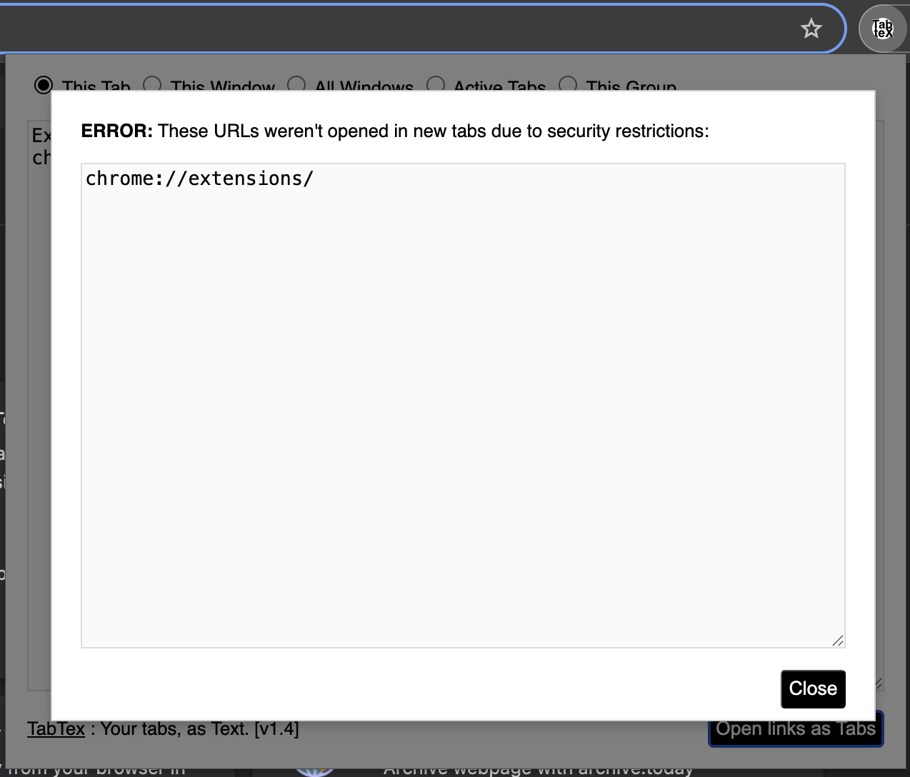
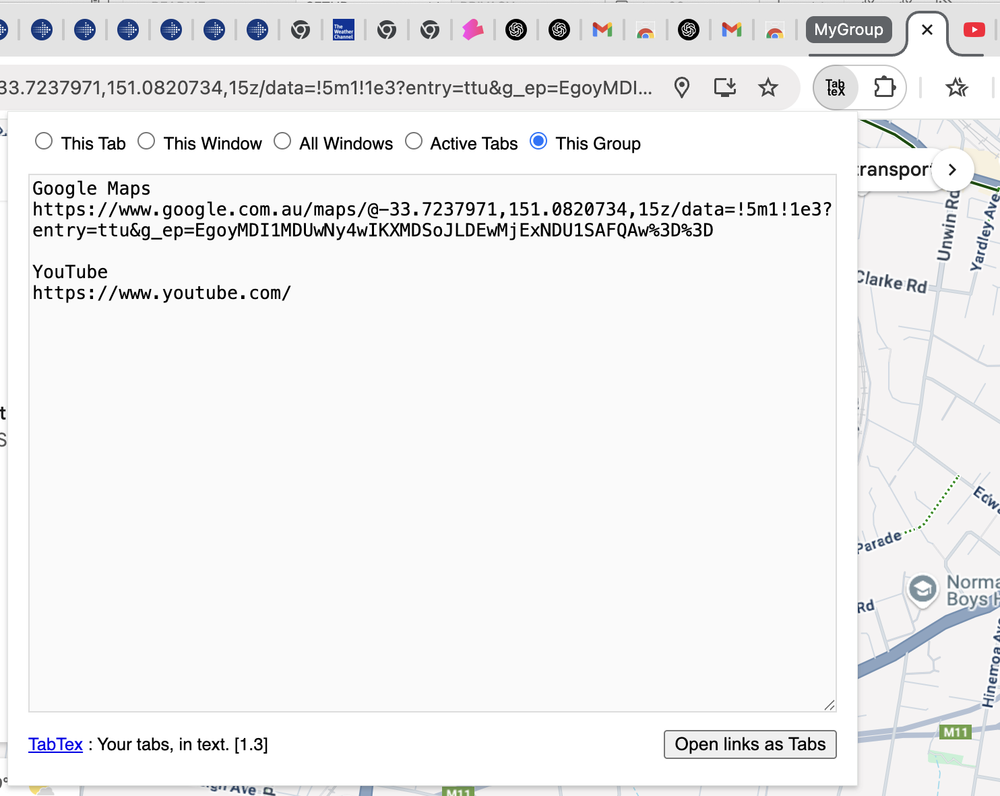
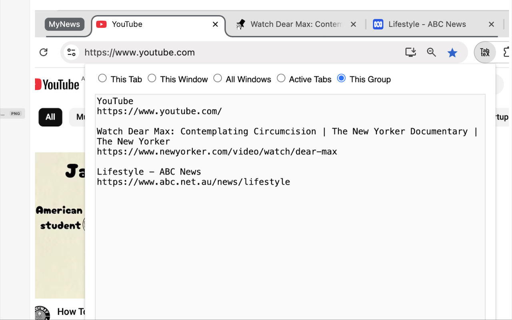
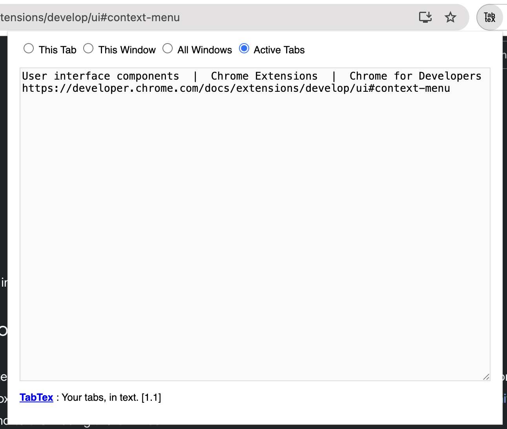
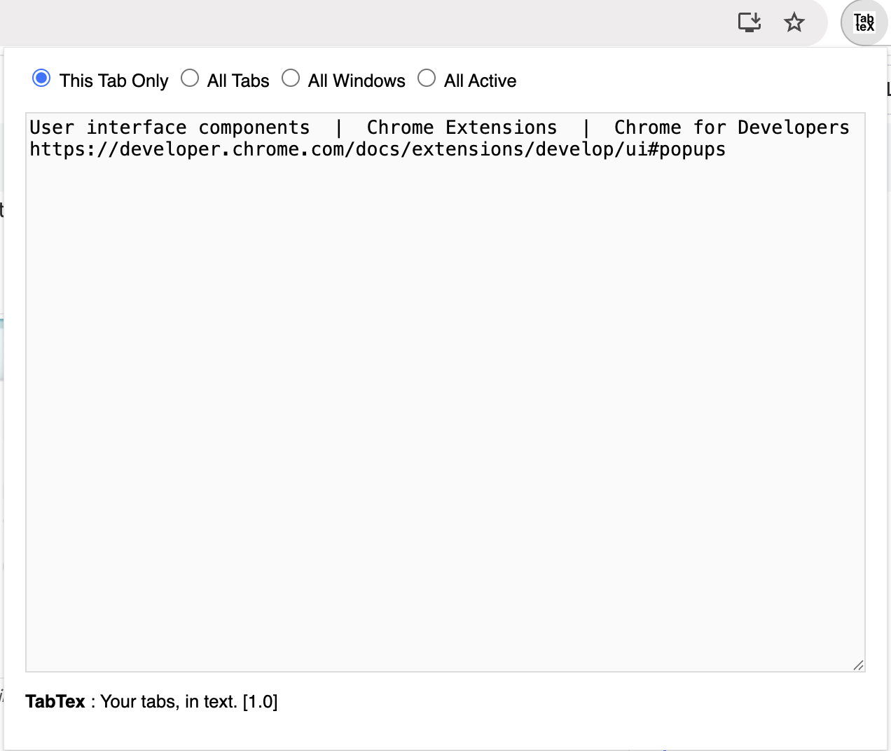

## Release history

#### Future intentions..
1) Re-open URLs as Tab-groups as Tab Groups 
2) Tab group should be visible only when tab-groups are present that current tab is a part of
3) Tab groups to export all across windows

#### v 1.4: Errors reported for re-opening URLs as Tabs - June 2025
1) Given a list of URLs (titles are ignored), now it is possible to create TabGroups using the chosen colour.
   
   
   
2) When opening URLs as new tabs, some URLs are not allowed to be re-created as new tabs. In v1.3 they were printed as warnings to the console. Now a popup lists such URLs if they were present among the requested URLs list, so that its easier to see if this happened.

   

#### v 1.3: Re-open tabs - May 2025
1) Re-open URLs as Tabs (Note: Tab groups are re-opened as individual tabs at present)
   a. Opens the tabs for http, https, ftp etc.
   b. When chrome://, moz:// edge://, prints a warning in the console
   (because they are not allowed to be programatically opened by the browser security)

#### v 1.2: Tab Group Export - April 2025
1) Added tab-groups exporting. When the current tab in focus is in a group, then lists all tabs in that group. This doesn't take into account any other tab groups.

#### v 1.1: Some feedback incorporated - Mar 2025
1) Rename the radio buttons so that they are more easier to understand (and takes less realestate on the pop-up)
2) Clean up the icon background (make it transparent)
3) Make it easier to update the extension (developer idea!) - made the TabTex text clickable, linked to the extension website
4) Save the user's last use export choice 
NOTE: Since this state is saved in browser itself, upon browser cache cleaning or browser application storage cleaning this will be removed.

#### v 1.0: First release - Mar 2025
First release with a few choices of Title and URL extraction from the open tabs in Chrome. A simple, fast UI that aims to get to works with no gimmick.

Options available (to extract the Title and URL) are as follows:
1) This tab (Current tab active in the current window)
2) All tabs in this window (All the open tabs in the current window)
3) All tabs in all windows (All tabs across all the Chrome windows)
4) All active tabs across windows (All active tabs meaning the one that's visible at first across all the tabs in Chrome)

---
Back to [README](README.md) | Any suggestions? [Issue register](https://github.com/madukan/tabtex/issues)

