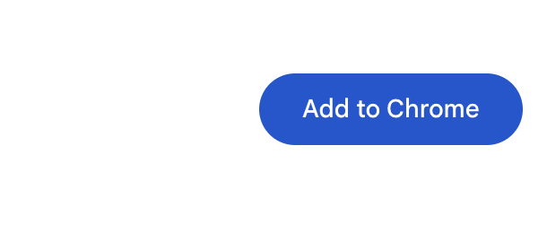
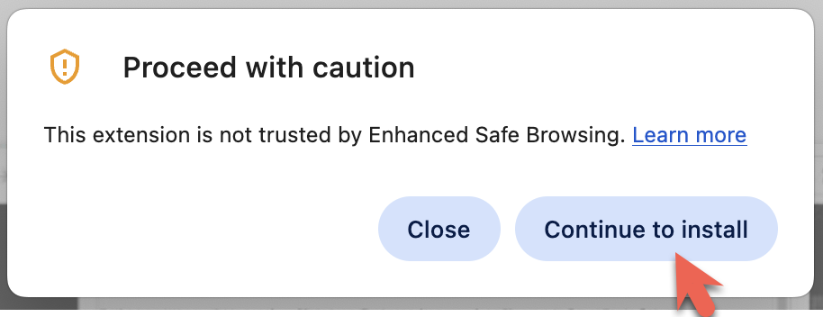
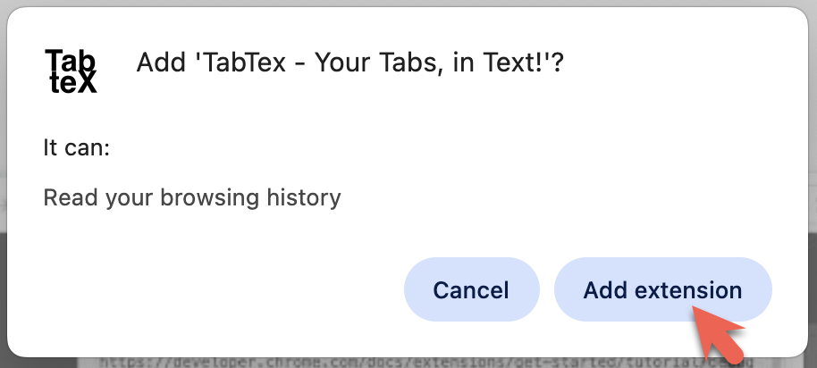
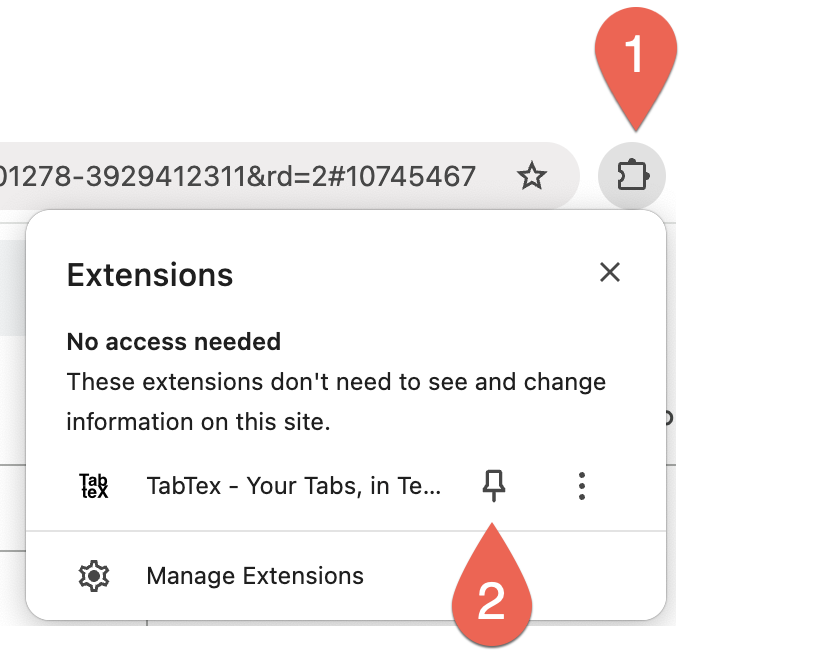
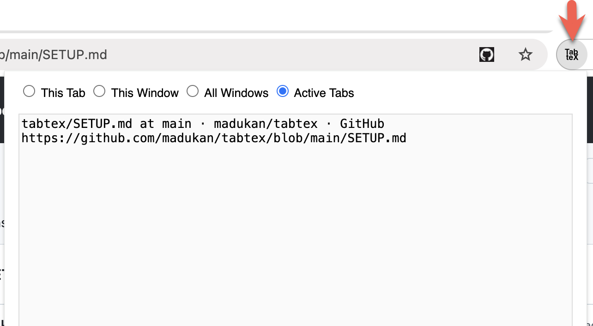

First and foremost. This extension doesn't read your browsing history. It will read the tab titles and URLs in the way you ask it to (by choosing the radio button in its UI). But you need to agree to the permissions there and get passed the warnings to install it in your browser.

So, here are the steps:

1) Navigate to https://chromewebstore.google.com/detail/tabtex-your-tabs-in-text/biegdeiiiaifgdaibelghkalfhdpifnm
   Or you can search TabTex in chrome webstore and then click on the TebTex result
   https://chromewebstore.google.com/search/TabTex

2) Click Add to Chrome button (right top end of the screen)
   It looks like this (as at 27/05/2025):
   
3) Click "continue to install" button.
   Now this looks scary, but code-wise it does no more than it says!

4) Click the "Add extension" button.
   Again this looks scary too, but again, code-wise it does no more than it says it does!

5) Now you should see the little icon, 
   
6) Now, simply click on the TabTex button in the browser.

That's it. You're all set. Enjoy!

---
Back to [README](README.md)
